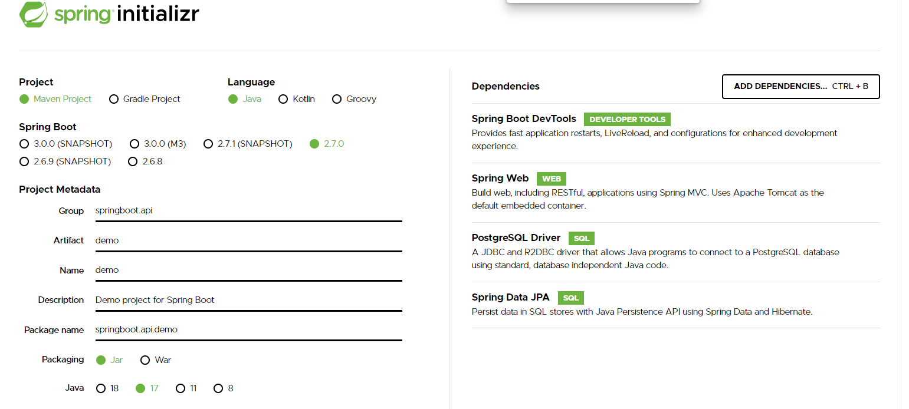
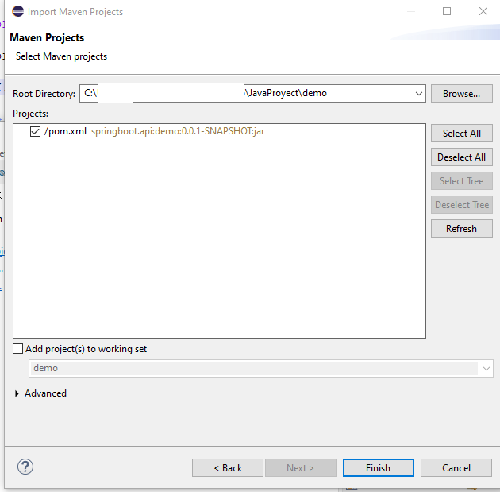
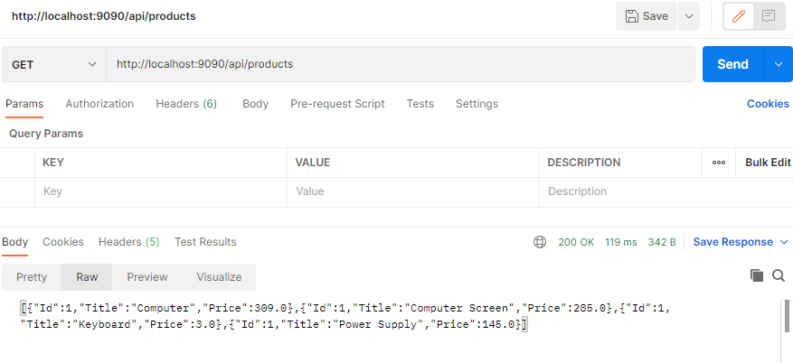

# Java with PostgreSQL

## Prerequisites
Go to https://start.spring.io/ to generate a Spring Boot project skeleton. 



After download the XXX.zip file you can import it to eclipse.

Select File > Import > Maven > Existing Maven Projects. Browse the project root folder and select the *pom.xml* file.



## Adding Controller
Add our first controller

```
package springboot.api.demo;

import java.util.ArrayList;
import java.util.List;
import org.springframework.web.bind.annotation.GetMapping;
import org.springframework.web.bind.annotation.RequestMapping;
import org.springframework.web.bind.annotation.RestController;
import java.util.Random;

@RestController
@RequestMapping("/api")
public class ProductController {
 
 @GetMapping("/products")
 public List<Product> getAllProducts() {
  final List<Product> productList = new ArrayList<Product>();

  //Create instance of Random class
  Random rand = new Random();
  
  //Add product to list
  productList.add(new Product(1, "Computer", rand.nextInt(1000)));
  productList.add(new Product(1, "Computer Screen", rand.nextInt(300)));
  productList.add(new Product(1, "Keyboard", rand.nextInt(200)));
  productList.add(new Product(1, "Power Supply", rand.nextInt(150)));

  return productList;
 } 
}

```

## I don't want any DB, Why this fails?
At this point if you don't want use any DB, you can use this project for testing, labs or others things. To avoid starting fails move to *DemoApplication.java* and replace this:

```
@SpringBootApplication
```

With this:

```
@SpringBootApplication(exclude = {DataSourceAutoConfiguration.class })
```

## Test API using Postman
Open postman, create a GET request with the URL *http://localhost:9090/api/products*. If we launch the request we should recieve something like that:


